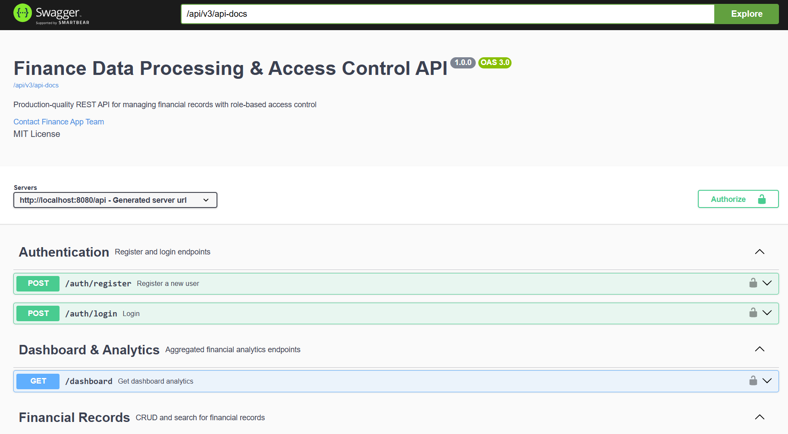

# 💰 Finance Data Processing & Access Control API

A production-style backend system built using Java Spring Boot that manages financial records with secure role-based access control and provides analytical dashboard insights.

---

## 🚀 Features

- 🔐 JWT-based Authentication
- 👤 Role-Based Access Control (Viewer, Analyst, Admin)
- 💰 Financial Records Management (CRUD + Filtering)
- 📊 Dashboard Analytics (income, expenses, trends)
- ⚠️ Validation & Global Error Handling
- 📄 API Documentation with Swagger UI

---

## 🛠️ Tech Stack

- Java (Spring Boot)
- Spring Web
- Spring Data JPA (Hibernate)
- Spring Security (JWT)
- MySQL
- Lombok
- Swagger (OpenAPI)

---

## 👥 User Roles

| Role | Permissions |
|------|------------|
| Viewer | View dashboard only |
| Analyst | View financial records + analytics |
| Admin | Full access (users + records) |

---

## 🔐 Authentication

- JWT-based authentication
- Login returns a token
- Include token in header:

```http
Authorization: Bearer <your_token>
```

---

## 📊 API Documentation (Swagger)

Access Swagger UI here:

👉 http://localhost:8080/api/swagger-ui.html

Use it to explore and test all endpoints interactively.

### Swagger UI Preview



---

## 📦 API Modules

### 🔑 Authentication
- Register user
- Login user (returns JWT)

### 👤 User Management (Admin Only)
- Create users
- Assign roles
- Activate/Deactivate users

### 💰 Financial Records
- Create record
- Update record
- Delete record
- Get records
- Filter by:
  - Date range
  - Category
  - Type

### 📊 Dashboard & Analytics
- Total income
- Total expenses
- Net balance
- Category-wise totals
- Monthly trends
- Recent transactions

---

## 🗄️ Database Setup (MySQL)

Update `application.properties`:

```properties
spring.datasource.url=jdbc:mysql://localhost:3306/finance_dashboard?useSSL=false&serverTimezone=UTC&allowPublicKeyRetrieval=true&createDatabaseIfNotExist=true
spring.datasource.username=root
spring.datasource.password=${DB_PASSWORD}
```

---

## ▶️ Running the Project

1. Clone the repository:

```bash
git clone https://github.com/ksham2135/Finance-Data-Processing-and-Access-Control-Dashboard.git
```

2. Navigate to project folder:

```bash
cd Finance-Data-Processing-and-Access-Control-Dashboard
```

3. Set environment variable:

```bash
# Linux/macOS
export DB_PASSWORD=your_mysql_password

# Windows PowerShell
$env:DB_PASSWORD="your_mysql_password"
```

4. Run the application:

```bash
./mvnw spring-boot:run
# or
mvn spring-boot:run
```

5. Open Swagger UI:

```text
http://localhost:8080/api/swagger-ui.html
```

---

## 🧪 Sample Data (Optional)

Seeded sample data includes:
- 1 Admin
- 1 Analyst
- 1 Viewer
- Sample financial records

---

## ⚠️ Assumptions

- Users must be authenticated to access protected endpoints
- Only admins can manage users and create/update/delete financial records
- Data is stored in local MySQL
- JWT is used for stateless authentication

---

## ⭐ Improvements (Future Scope)

- Pagination & search enhancements
- Unit & integration tests
- Deployment (Render / AWS)
- Advanced analytics

---

## 📌 Author

Krishna

---

## 📄 License

MIT License
